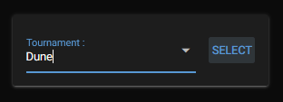
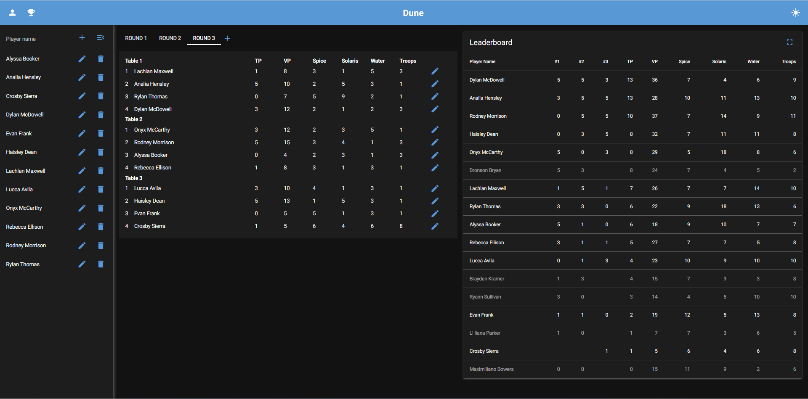
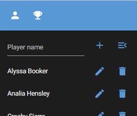
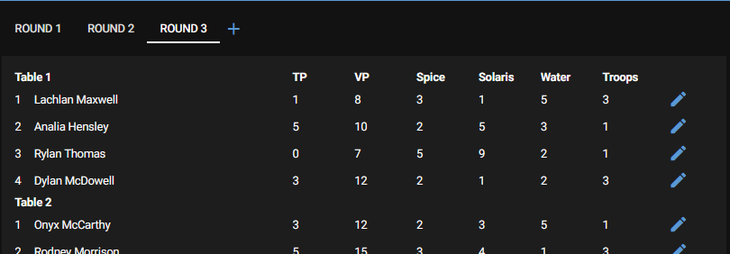
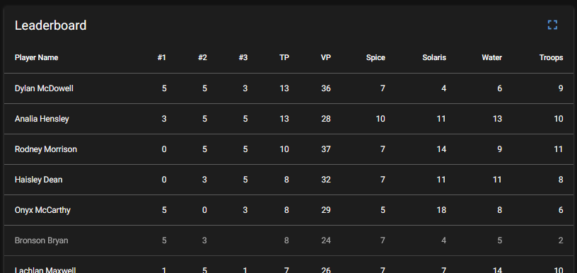

# Scoreboard

This application allow to manage your tournaments scoreboards.

You can:
- Create/select tournaments;
- Add/remove players;
- Create new rounds;
- Add/edit players scores; 
- Display the leaderboard. Even in fullscreen!

## Build

Using `pysintaller`:
```
python -m pyinstaller scoreboard.spec 
```
The executable should be in `dist/scoreboard.exe`

## Usage

### Tournament selection



When starting the application, you will be directed to the tournament selection page.
Here you can select an existing tournament.

You can also create a new tournament by entering a new name before selecting it.

> [!TIP]
> Be sure to hit enter to select the tournament before clicking on `SELECT` when you create a new tournament.

Clicking on select will redirect you to the tournament scoreboard.

### Scoreboard



Here you can manage the full scoreboard of a tournament.
The scoreboard is divided in 3 parts:
- The players management
- The rounds management
- The leaderboard

#### Menu


In the menu you will find:
- A button to display/hide the players drawer panel.
- A button to go back to the tournament selection page.
- The name of the current tournament.
- A button to switch between dark and light mode.

#### Players management



> [!NOTE]
> If hidden, this panel can be shown using the `person` button in the menu.
 
In the first row, you can enter a new player name and add it to the tournament. You can also hide the panel.

Next rows are the list of the players in the tournament. For each of them, you can edit their name or remove them from the tournament.

#### Rounds management



Here, you can view and modify each round. And create a new round.

You can create a new round using the `add` button. 
The tables are created using the _swiss_ format. The first table contains the best players, the second, the players behind them, and so on. We avoid to place a player twice at the same place on a table.

For each player, you can enter their score using the `modify` button.

#### Leaderboard



Here, you see the list of players ordered by their score.

All players with a score in any round is displayed. The players who are not in the tournament anymore are greyed out.

For each player, you see their name, their tournament points (the first score value) for each round and their total score.

You can display the leaderboard in full screen using the full screen button on the top right.

### Configuration

```
tournament:
  table_size: 4
  score:
    - name: 'tournament_points'
      descending: True
      label : 'TP'
    - name: 'victory_points'
      descending: True
      label : 'VP'
...
database:
  url: sqlite://data/dune_scoreboard.db
gui:
  dark: True
  favicon: data/dune.ico
  native: False
```

You can manage the format of you tournaments using the `data/config.yml` file.

You can change:
- The size of each tables
- The values of the scores (their name, order and displayed label).

> [!NOTE]
> In native mode, the application will start in a window. But it can still be accessed via a browser.


## Contact

benoitdaene __@__ gmail.com